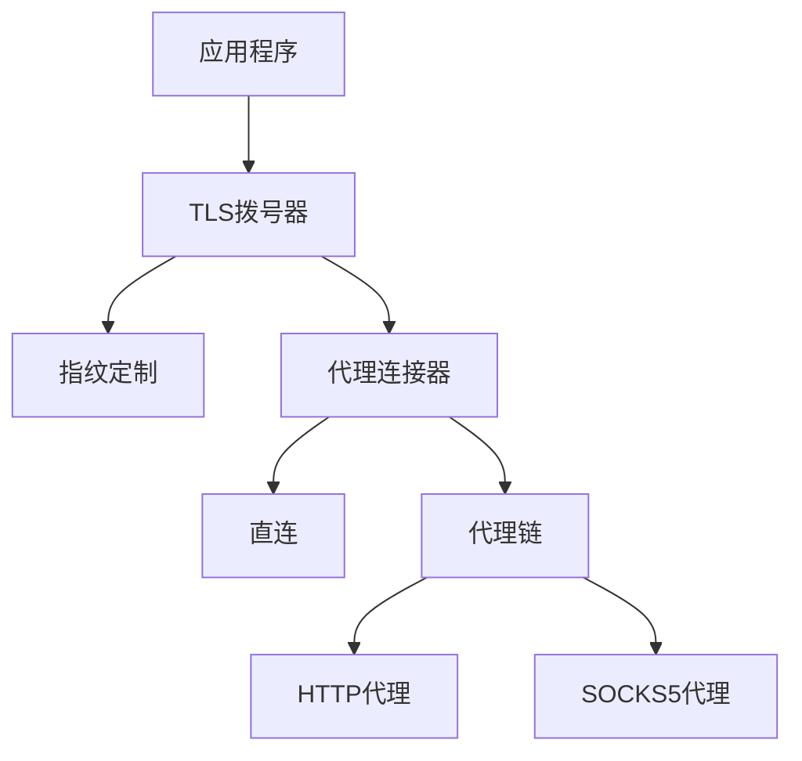

# TLS MITM Module

[](https://golang.org)
[](LICENSE)
[](VERSION)

一个基于Go实现的TLS指纹模拟模块库，支持MITM代理和多级代理链。

## 版本说明

当前版本：[v0.3.0-alpha](VERSION)

- [版本管理规范](VERSIONING.md)
- [更新日志](CHANGELOG.md)

我们遵循[语义化版本规范](https://semver.org/lang/zh-CN/)进行版本管理。

## 功能特性

- 🎭 可定制的TLS Client Hello指纹
- ⛓️ HTTP/SOCKS5多级代理链支持
- 🔄 HTTP1.1/HTTP2 协议自动协商
- 📝 可扩展的日志接口

## 技术栈

- Go 1.23+
- [utls](https://github.com/refraction-networking/utls) - TLS指纹定制
- [zerolog](https://github.com/rs/zerolog) - 高性能日志库

## 快速开始

### 安装

```bash
go get github.com/aberstone/fingertls
```

### 基本用法

```go
import (
    "github.com/aberstone/fingertls/transport/tls"
    "github.com/aberstone/fingertls/transport/tls/fingerprint"
)

// 创建TLS拨号器
dialer := tls.NewTLSDialer(
    tls.WithSpecFactory(fingerprint.GetDefaultClientHelloSpec), // 设置TLS指纹
    tls.WithUpstreamProxy(upstreamProxy),                      // 可选：设置上游代理
    tls.WithProxyTimeout(30),                                  // 可选：设置超时时间
)

// 建立TLS连接
conn, err := dialer.DialTLS(context.TODO(), "tcp", "example.com:443")
```

更多使用示例请参考[examples](examples/)目录。

## 模块架构

### 核心组件



### 关键特性

1. TLS指纹模拟
   - 支持自定义Client Hello
   - 协议版本自动协商

2. 代理链路由
   - 灵活的代理链配置
   - 多种代理协议支持

## 开发指南

### 环境要求

- Go 1.23+

### 代码结构

```
.
├── transport/         # 传输层模块
│   ├── tls/          # TLS相关实现
│   │   ├── fingerprint/  # 指纹模拟
│   │   └── proxy/        # 代理支持
│   └── proxy_connector/  # 代理连接器
├── logging/          # 日志接口
└── examples/         # 使用示例
```

## 贡献指南

我们欢迎任何形式的贡献！在提交代码前，请确保阅读：

- [版本管理规范](VERSIONING.md)
- [贡献指南](CONTRIBUTING.md)

### 贡献流程

1. Fork 项目
2. 创建特性分支 (`git checkout -b feature/amazing-feature`)
3. 提交更改 (`git commit -m 'feat: add amazing feature'`)
4. 推送到分支 (`git push origin feature/amazing-feature`)
5. 提交Pull Request

### 提交规范

我们使用[Conventional Commits](https://www.conventionalcommits.org/)规范：

- feat: 新功能
- fix: 修复
- docs: 文档更新
- style: 代码风格修改
- refactor: 重构
- test: 测试相关
- chore: 构建/工具链/辅助工具的变动

## 许可证

本项目采用 GNU Lesser General Public License v3.0 (LGPL-3.0) 许可证。这意味着：

- ✔️ 商业用途
- ✔️ 修改
- ✔️ 分发
- ✔️ 私人使用
- ❗ 必须公开源代码
- ❗ 需要保留许可证和版权信息
- ❗ 需要说明修改内容

查看 [LICENSE](LICENSE) 文件了解详情。

## 支持与反馈

- 提交 [Issue](https://github.com/aberstone/fingertls/issues)
- 发送邮件至 aberstone.hk@gmail.com

---

⭐️ 如果这个项目对你有帮助，欢迎点Star支持！