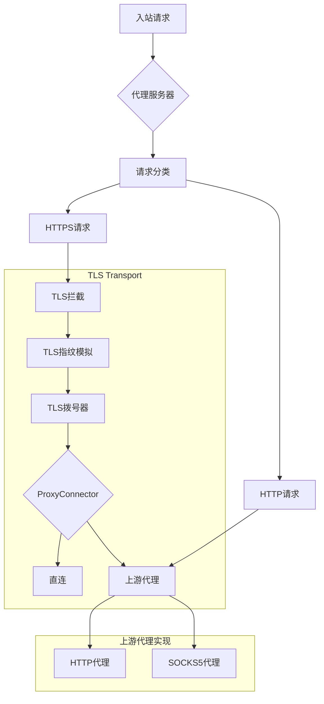

# TLS MITM Server

[](https://golang.org)
[](LICENSE)
[](VERSION)

一个基于Go实现的MITM代理服务器，支持自定义TLS指纹和多级代理链。

## 版本说明

当前版本：[v0.2.1-alpha](VERSION)

- [版本管理规范](VERSIONING.md)
- [更新日志](CHANGELOG.md)

我们遵循[语义化版本规范](https://semver.org/lang/zh-CN/)进行版本管理。

## 功能特性

- ✨ 中间人代理服务器，支持拦截和处理HTTP及HTTPS流量
- 🔑 基于自签名CA证书的TLS会话拦截
- 🎭 可自定义TLS Client Hello指纹，支持多种预设配置
- ⛓️ 灵活的代理链配置，支持HTTP和SOCKS5上游代理
- 📝 结构化日志记录，支持多种输出格式
- 🚀 异步处理设计，高效的请求处理
- 🔧 完善的配置选项和命令行参数支持

## 技术栈

- Go 1.23+
- [utls](https://github.com/refraction-networking/utls) - TLS指纹定制
- [goproxy](https://github.com/elazarl/goproxy) - 代理服务器基础功能
- [zerolog](https://github.com/rs/zerolog) - 高性能日志库

## 快速开始

### 安装

```bash
# 克隆仓库
git clone https://github.com/aberstone/tls_mitm_server.git

# 进入项目目录
cd tls_mitm_server

# 编译
make
```

### 生成CA证书

首次使用需要生成CA证书：

```bash
./build/gen-ca
```

此命令会在当前目录生成：
- ca.crt - CA证书
- ca.key - CA私钥

### 启动代理服务器

```bash
./build/mitm --port 8080 --ca-cert ca.crt --ca-key ca.key
```

### 配置选项

```bash
Usage of ./build/mitm:
  --port int            代理服务器监听端口 (默认 8080)
  --ca-cert string      CA证书路径 (默认 "ca.crt")
  --ca-key string       CA私钥路径 (默认 "ca.key")
  --fingerprint string  TLS指纹类型 (default, chrome, firefox等)
  --upstream string     上游代理URL (可选，支持HTTP和SOCKS5)
  --log-level string   日志级别 (debug, info, warn, error)
  --log-format string  日志格式 (text, json)
  --verbose            显示详细日志
```

## 架构设计

### 核心组件



### 关键特性

1. 模块化设计
   - 请求处理器接口
   - TLS指纹定制组件
   - 代理连接器抽象
   - 可扩展的上游代理支持
   - 可扩展的日志系统

2. 高性能实现
   - 异步请求处理
   - 高效的日志记录
   - 合理的资源管理

## 开发指南

### 环境要求

- Go 1.23+
- Make
- Git

### 本地开发

1. 克隆仓库
```bash
git clone https://github.com/aberstone/tls_mitm_server.git
```

2. 安装依赖
```bash
go mod download
```

3. 运行测试
```bash
make test
```

4. 构建项目
```bash
make
```

### 代码结构

```
.
├── cmd/                # 命令行工具
│   ├── mitm/          # 代理服务器
│   └── generate-ca/   # CA证书生成工具
├── internal/          # 内部包
│   ├── cert/         # 证书处理
│   ├── config/       # 配置管理
│   ├── errors/       # 错误处理
│   ├── fingerprint/  # TLS指纹
│   ├── interfaces/   # 接口定义
│   ├── logging/      # 日志系统
│   ├── proxy/        # 代理核心
│   └── transport/    # 传输层
└── build/            # 编译产物
```

## 贡献指南

我们欢迎任何形式的贡献！在提交代码前，请确保阅读：

- [版本管理规范](VERSIONING.md)
- [贡献指南](CONTRIBUTING.md)

### 贡献流程

1. Fork 项目
2. 创建特性分支 (`git checkout -b feature/amazing-feature`)
3. 提交更改 (`git commit -m 'feat: add amazing feature'`)
4. 推送到分支 (`git push origin feature/amazing-feature`)
5. 提交Pull Request

### 提交规范

我们使用[Conventional Commits](https://www.conventionalcommits.org/)规范：

- feat: 新功能
- fix: 修复
- docs: 文档更新
- style: 代码风格修改
- refactor: 重构
- test: 测试相关
- chore: 构建/工具链/辅助工具的变动

## 许可证

本项目采用 GNU Lesser General Public License v3.0 (LGPL-3.0) 许可证。这意味着：

- ✔️ 商业用途
- ✔️ 修改
- ✔️ 分发
- ✔️ 私人使用
- ❗ 必须公开源代码
- ❗ 需要保留许可证和版权信息
- ❗ 需要说明修改内容

查看 [LICENSE](LICENSE) 文件了解详情。

## 支持与反馈

- 提交 [Issue](https://github.com/aberstone/tls_mitm_server/issues)
- 发送邮件至 aberstone.hk@gmail.com

---

⭐️ 如果这个项目对你有帮助，欢迎点Star支持！